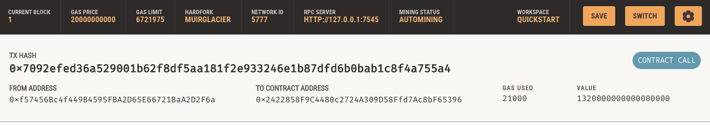
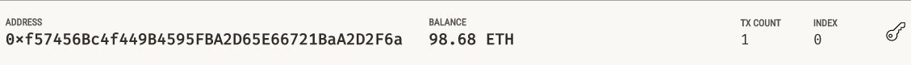

# Ether Pay
**Ether Pay** is a user-friendly web application that allows customers to hire FinTech professionals and pay them with cryptocurrency instantly.
---
---

# **Link to the web application** click [here](http://10.0.0182:8501)


Content incudes:

* [Technologies](#technologies)

* [App Development](#app-development)

* [App Demo](#app-demo)

* [Contributors](#contributors)

---

## Technologies
>This project leverages python 3.7

* [Streamlit](https://streamlit.io/) - Deploy application into shareable web app

* [Dataclasses](https://docs.python.org/3/library/dataclasses.html) - Use the decorator and functions to generate methods automatically

* [Typing](https://docs.python.org/3/library/typing.html) - Provides runtime support for type hints

* [Web3](https://web3py.readthedocs.io/en/stable/) - Python library for ineracting with Ethereum

* [Mnemonic](https://pypi.org/project/mnemonic/) - Generating mnemonic seed phrase

* [BIP44](https://pypi.org/project/bip44/) - Python library for deriving hierarchical deterministic wallets

* [Ganache](https://trufflesuite.com/ganache/) - A personal Ethereum blockchain for test, inspect, and operate blockchain transactions

```python
pip install web3==5.17
pip install eth-tester==0.5.0b3
pip install mnemonic
pip install bip44
```
---

## App Development

Create `.env` file and add mnemonic seed phrase provided by Ganache

Create 2 py files: 
* crypto_wallet.py: This file contains the Ethereum transaction functions that will be integrate in the `fintech_finder.py` file.
    * `generate_account()`
    * `get_balance()`
    * `send_transaction()`

* Class Block: This file contains Fintech professionals database and integrates functions from `crypto_walleet.py` file and incorporate `Streamlit` UI.
    * `get_people()`
    * Streamlit design


---

## App Demo

Go to the file folder contains pychian.py file and 

**Run application using command line** under the virtual environment contains all necessary dependencies

```python
streamlit run fintech_finder.py
```


---


**Make transaction and add to blockchain**


---

**Check transaction Record on Ganache**



---
**Review Balance**


---

---
## Contributors

**Yanjun Lin Andrie** <span>&nbsp;&nbsp;</span> |
<span>&nbsp;&nbsp;</span> email: yanjun.lin.andrie@gmail.com <span>&nbsp;&nbsp;</span>|
<span>&nbsp;&nbsp;</span> [](https://www.linkedin.com/in/yanjun-linked/)

**UC Berkeley Extension**

---

## License

[](LICENSE)
